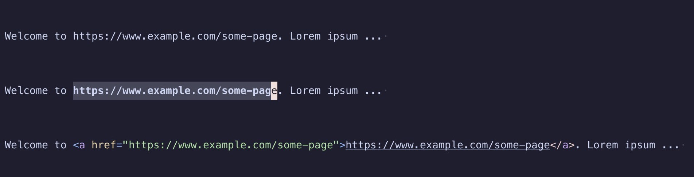

# wrapit

## IN PROGRESS

Creates a tag(a, img) by selecting string url.



1, select a url
2, run command(or keymap)

```lua
vim.keymap.set("v", "<leader>l", ":lua require('linkit').link()<CR><CR>")
vim.keymap.set("v", "<leader>k", ":lua require('linkit').image()<CR><CR>")
```

